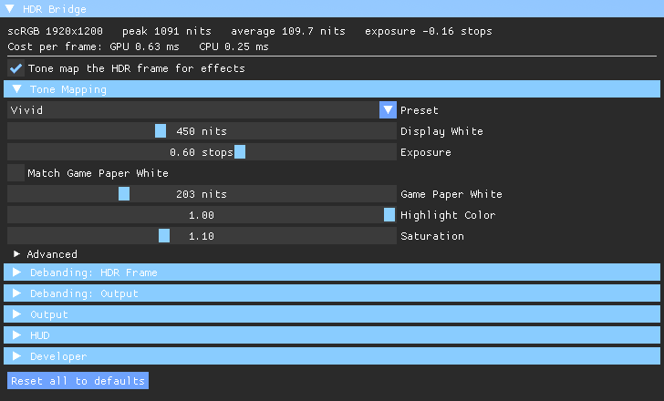
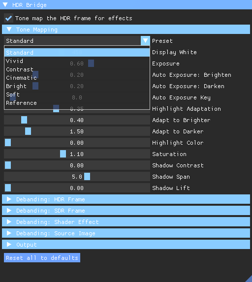
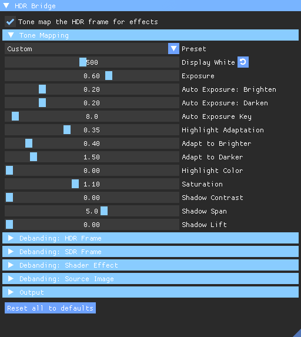
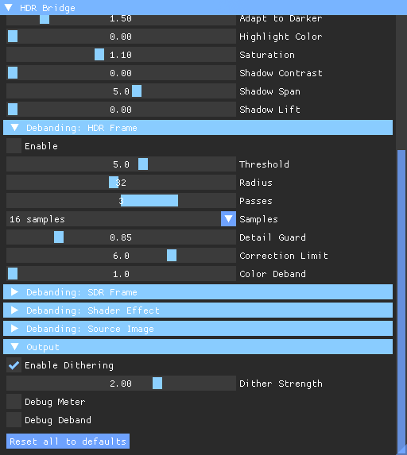

# HDR Bridge

A ReShade add-on that lets a game turn on its HDR output on a plain SDR
monitor, and makes Windows show the result.

Why you would want that: a game's own SDR picture is its HDR render put
through a tone curve and cut to 8 bits, and how well that curve treats the
highlights is up to the game. Some handle it well. Others clip bright skies,
flatten sun glow and fire, or bleach bright colors toward white. The HDR
render is the same either way. With HDR Bridge the game renders HDR and the
add-on tone maps that frame to SDR with its own curve, which you can tune, and
ReShade effects then run on the result exactly as they would in an SDR game.

It is for monitors that cannot take an HDR signal at all. On a monitor that
does accept HDR, use the game's HDR normally.

## What it does

- Reports an HDR10 capable display to the game on every route I have seen a
  game use to ask:
  - DXGI, through `IDXGIOutput6::GetDesc1`, and `CheckColorSpaceSupport` on
    the swap chain.
  - The Windows display configuration, through `DisplayConfigGetDeviceInfo`.
    On Windows 11 an SDR monitor with Auto Color Management already claims
    advanced color there, but with a flag that means HDR is off, so a careful
    game still says unavailable.
  - NVIDIA's NVAPI. When the monitor is driven by another GPU, an integrated
    one for instance, the driver cannot find it and the game gives up before
    asking about HDR, so HDR Bridge hands back a stand-in display ID.
- Accepts the game's NVAPI request to switch the display to HDR without
  passing it on, since the monitor could not take it.
- Labels the swap chain so Windows shows it correctly. A float swap chain in
  NVAPI HDR mode is declared scRGB, which is what the driver would have done;
  without it Windows shows the linear values two stops dark. An HDR10 swap
  chain is labeled sRGB while the tone mapping runs, since the frame is sRGB
  by the time it is shown, and the game and ReShade still see the PQ color
  space the game asked for. With the tone mapping off it keeps its PQ label
  and Windows converts it for the SDR display.
- Tone maps the HDR frame to SDR before ReShade's effects run, and hands
  their result back to the swap chain afterwards, dithered for the 8-bit
  signal Windows sends to the monitor. It also runs while effects are switched
  off or still loading, so the raw HDR frame never reaches the screen.
- Runs a game that asks for exclusive fullscreen in a borderless window over
  the monitor, and tells the game it is exclusive. Games that only offer HDR in
  exclusive fullscreen otherwise drop out of it for good on Alt+Tab.
- Saves the game's frame at full precision on a hotkey, before any ReShade
  effect, as a float image with a JSON sidecar.

Nothing is changed outside the game process. The monitor, its EDID and the
Windows HDR setting are left alone.

Two things it does so it can coexist with other mods. It reads the system
`dxgi.dll` that is already loaded rather than loading it again, since a proxy
such as OptiScaler answers that load with itself and sets up its overlay too
early. And when a mod setup unloads ReShade and loads it again in the same
process, HDR Bridge registers with the new ReShade, which would otherwise never
send it events or show its settings panel.

## Requirements

- ReShade 6 with full add-on support, installed for the game's DirectX 11 or
  12 renderer. The add-on is built against ReShade 6.8.0.
- A game with an HDR output mode on PC.

## Installing

Get it from [Nexus Mods](https://www.nexusmods.com/site/mods/2409) or build it
yourself (see below).

1. Copy `hdrbridge.addon64` next to the game's ReShade DLL.
2. Make ReShade load it at startup, so the hooks are in place before the game
   asks what the display supports. In `ReShade.ini`:

   ```
   [ADDON]
   LoadFromDllMain=hdrbridge.addon64
   ```

3. Start the game, set its window mode to fullscreen, and turn HDR on in its
   display settings, where the option should now be available.

With tone mapping switched off, the picture looks wrong on an SDR monitor:
blown out for a float swap chain, washed out for HDR10. That is the raw HDR
frame on an SDR signal, and it is expected.

## Tone mapping

The tone mapping has its own HDR Bridge tab in ReShade's overlay. At the top
it shows what the game is sending and what HDR Bridge costs: the HDR mode, the
measured peak and average in nits, the exposure in stops, and the GPU and CPU
time it adds to each frame. Below that, the settings most people need come
first, and the rest fold away under Advanced. Hover a setting for what
it does. A reset button appears beside any setting that has moved.



The curve is the ITU-R BT.2390 roll-off, the one written for showing an HDR
master on a display with less range. Below its knee it passes the game's
shadows and midtones through as graded, and above it compresses highlights
smoothly into SDR white instead of clipping them.

The Preset list at the top of Tone Mapping sets them all at once:

| Preset | What it changes |
|---|---|
| Standard | The defaults. BT.2390 on each channel, so bright colors bleach toward white as most games' own SDR picture does |
| Vivid | Bright colors keep their hue and saturation all the way up |
| Contrast | Steeper tones below the scene average, closer to a typical SDR grade |
| Cinematic | Contrast's shadows, a little darker and less saturated, and stronger adaptation to bright light |
| Bright | Lifts dark scenes and interiors toward a readable level; daylight is left alone |
| Soft | Lower contrast: raised deep shadows, more room for highlights, slightly gentler color |
| Reference | The game's own exposure, with no metering or adaptation |



Moving any setting under it shows Custom, and its reset button goes back to the
preset's value. Picking a preset again puts all of its values back.



Vivid shows any steps the HDR frame carries in a bright gradient as colored
rings, where Standard compresses them away with the rest of the highlight. A
clean frame has none, but some upscaler models hand over a stepped one. If a
sun or a lamp grows rings, try another upscaler model or use Standard.

Match Game Paper White takes the Paper White value from the game's own HDR
menu and compensates Exposure for it, so the picture stays put whatever that
menu says. Highlight Compression, under Advanced, moves where the roll-off
starts: lower keeps highlights bright until they reach white, higher keeps
more detail in them. Auto Exposure Range sets how far exposure may adapt
either way.

Debanding is off by default, since it costs some faint texture and a clean
frame does not need it. Turn it on for a game whose skies or glows arrive
banded. The dither that hides the 8-bit steps changes every frame; Static
Grain holds it still for anyone who sees it shimmer.



### Protect HUD

With [HUD Mask](https://github.com/danyalziakhan/hudmask) installed, Protect HUD
keeps the game's HUD steady. With Protect HUD off, the HUD rides the scene's
exposure: in Odyssey, a fight in a ship full of black smoke brightens the
exposure and the HUD with it. With it on, the HUD is tone mapped like
everything else but at a fixed exposure, set by Exposure, Match Game Paper
White and HUD Brightness, so auto exposure and highlight adaptation never reach
it. The highlight roll-off still follows the scene's peak, which only touches
the brightest parts of the HUD. It also skips the debanding and the dither,
blended by its own alpha so translucent panels keep their share of the scene
behind them. ReShade effects still apply to it; one that should leave the HUD
alone can read HUD Mask's texture itself, as PHDRPlus does. Games that draw
full-screen menus as HUD, Odyssey among them, get those menus at the same fixed
exposure.

The HUD is also left out of the metering, so bright text does not set the peak
and a dark panel does not lift the exposure. A full-screen menu leaves nothing
else to meter, so as the visible part of the screen falls from 40% to 15% the
metering hands back to the whole frame and the exposure keeps following it.

The toggle is grayed out without HUD Mask, and in games where HUD Mask finds the
HUD on the back buffer rather than in a texture of its own: there the mask is
only built after the frame has already been tone mapped. The line under it says
which applies. Debug View has a HUD coverage view for checking the mask.

Changes apply at once and are saved to `hdrbridge.cfg` next to the add-on, one
file per game. It is plain text, `Name=value` per line with `#` for comments.
`Preset` names the preset, and the lines after it are only what was changed
from it, so a game on a preset follows it when the preset is retuned. Values
outside a slider's range are brought back inside it.

```
# Settings for this game
Enabled=1
Preset=Vivid
Exposure=0.4
```

`Enabled=0` switches the tone mapping off and leaves the frame as the game
drew it, for an effect chain that does its own.

## For developers

The Developer section of the tab is for anyone working on HDR, a mod or an
effect:

- Debug views, in place of the picture: false color by scene brightness in
  nits, with a legend; pixels clipped to SDR white or crushed to black;
  colors outside BT.709; NaN pixels the game sent; and the frame
  without tone mapping.
- Compare splits the screen, tone mapped on the left and on the right the HDR
  frame clipped at SDR white, which is what Windows shows of a float frame
  without tone mapping. Drag the line with the overlay open.
- A histogram of the scene in nits, on a log scale, with the tone curve drawn
  over it and markers for the scene average, the start of the highlight
  roll-off and the measured peak.
- A pixel probe that reads the HDR value in nits and the tone mapped SDR value
  of the pixel under the cursor.
- The swap chain's format, the color space the game asked for and what
  Windows is told, the display luminance reported to the game, and the GPU
  time of each stage.

The shader is `shaders\tonemap.hlsl`, laid out by `shaders\tonemap.manifest`,
and both are built into the add-on. The same files run in
[fxshot](https://github.com/danyalziakhan/fxshot), so the tone mapping can be
measured on captured frames without the game. This writes a copy fxshot can
load, with the screen size and color space filled in:

```
python tools\fxshot_tonemap.py out\tonemap --width 1920 --height 1200 --color-space 2
```

## Other settings

The capture key and borderless fullscreen can be changed in game, under HDR
Bridge in ReShade's Add-ons tab, and are saved to `ReShade.ini` straight away.
A change to borderless fullscreen applies the next time the game enters
fullscreen. Everything else is read once at startup. All keys are optional, in
`ReShade.ini` under `[HDRBRIDGE]`:

| Key | Default | Meaning |
|---|---|---|
| `SpoofDXGI` | 1 | Report HDR through DXGI and the Windows display configuration, and relabel HDR10 swap chains for Windows |
| `SpoofNVAPI` | 1 | Report HDR through NVAPI |
| `MaxLuminance` | 4000 | Peak nits reported to the game |
| `MinLuminance` | 0.005 | Black level nits reported to the game |
| `MaxFrameAverageLuminance` | 4000 | Full frame nits reported to the game |
| `BorderlessFullscreen` | 1 | Run a game that asks for exclusive fullscreen in a borderless window covering the monitor |
| `CaptureKey` | 145 (Scroll Lock) | Virtual key code that saves a frame |
| `OutputPath` | `HDRBridge Captures` next to the game | Where captures go |
| `HideNVAPIFromGame` | 0 | Diagnostic: deny NVAPI to the game's own code, so it takes the path it uses on AMD and Intel. Needs `SpoofNVAPI` |
| `TraceGameCalls` | 0 | Diagnostic: log the registry reads, device enumeration and NVAPI driver settings reads the game's own code makes |

## Captures

The capture key saves the swap chain as it leaves the game, before ReShade
runs any effect:

- `*_hdr.pfm`: linear light in nits, BT.709 primaries, 32-bit float, rows
  bottom to top as PFM stores them. Colors outside BT.709 keep their
  negative channels. HDR10 frames are decoded from PQ and converted.
- `*_sdr.pfm`: the SDR swap chain's own values, gamma encoded, in [0, 1].
- `*.json`: format, color spaces and the luminance range reported to the
  game.

Taking a frame with HDR on and again with it off, from a still camera, gives a
pair for comparing the tone mapping against the game's own SDR picture.

## Which games work

The HDR routes covered:

| Route | Swap chain | Example |
|---|---|---|
| DXGI, scRGB | half float | many DirectX 11 games |
| NVAPI HDR mode | half float | Assassin's Creed Origins, Odyssey |
| DXGI, HDR10 | 10-bit PQ | most DirectX 12 games |

Not covered: games that ask only through AMD's AGS library (on AMD GPUs), or
only through the WinRT `AdvancedColorInfo` API, and Vulkan or OpenGL games.

If a game still shows its HDR option as unavailable, read `ReShade.log`. The
DXGI, display configuration and NVAPI queries are logged with the real answer
and the one the game was given, and most with the module that asked, since
DXGI and the driver make many of these calls themselves. `TraceGameCalls` adds
the registry and device queries, for a game that decides some other way.

Tone mapping writes a line to the same log whenever its state changes, each
starting with `tone mapping:`: settings read and saved, preset changes, setup
for a new back buffer, and why a frame was left alone.

## Tools

Two small programs used to check what Windows actually sends to the monitor.
Neither is needed to use the add-on.

- `tools\screengrab.cpp`: saves the composed desktop through desktop
  duplication on F8, into a `screens` folder next to the program or a folder
  given as its argument. Ctrl+Alt+F8 quits. Use it to check the picture you
  see matches an offline render.
- `tools\dwmprobe.cpp`: shows a strip of known linear values through a float
  scRGB swap chain and prints what Windows sends for each, which is how
  Windows' encoding of scRGB for an SDR display was measured.

Build either from a Developer Command Prompt for VS 2022, from the repository
root. The program lands in the current folder.

```
cl /nologo /EHsc /O2 /std:c++17 tools\screengrab.cpp d3d11.lib dxgi.lib user32.lib
```
```
cl /nologo /EHsc /O2 /std:c++17 tools\dwmprobe.cpp d3d11.lib dxgi.lib user32.lib
```

## Building

Needs Visual Studio 2022 and CMake. Fetch the three dependencies into `deps`
first, from the repository root:

```
git clone --depth 1 --branch v6.8.0 https://github.com/crosire/reshade.git deps\reshade
```
```
git clone --depth 1 https://github.com/TsudaKageyu/minhook.git deps\minhook
```

The settings panel needs the exact Dear ImGui commit that ReShade pins, since
ReShade hands its own ImGui functions to the add-on. This prints it:

```
git -C deps\reshade ls-tree HEAD deps/imgui
```

For v6.8.0 that is `3912b3d9a9c1b3f17431aebafd86d2f40ee6e59c`:

```
git clone https://github.com/ocornut/imgui.git deps\imgui
```
```
git -C deps\imgui checkout 3912b3d9a9c1b3f17431aebafd86d2f40ee6e59c
```

Then:

```
cmake -S . -B build -G "Visual Studio 17 2022" -A x64
```
```
cmake --build build --config Release
```

The add-on is `build\Release\hdrbridge.addon64`. To build for another ReShade
version, clone its tag instead and check out the ImGui commit it pins.

## Development note

AI assistance was used during development, for reviewing code, finding bugs,
refining the implementation and writing documentation. All changes were reviewed
and tested before being included.

## License

MIT, see `LICENSE`.
